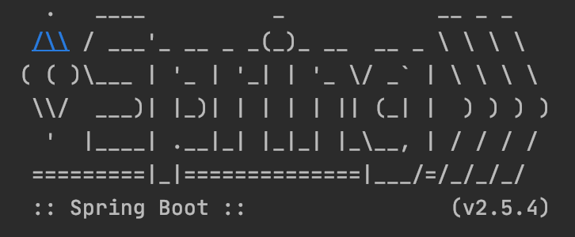

The example project for StringBoot service

<div align="center">
    
</div>

## Getting Started

## Project structure
```
.
├── hello-world
│   ├── Dockerfile
│   ...
├── docker-compose.yaml
|
└── README.md
```

## Prerequisites
- Make sure that you have Docker and Docker Compose installed
  - Windows or macOS:
    [Install Docker Desktop](https://www.docker.com/get-started)
  - Linux: [Install Docker](https://www.docker.com/get-started) and then
    [Docker Compose](https://github.com/docker/compose)

## Start project
## Start project in local
## Start project in docker 

- Start project
```console
docker-compose up -d
```

- Some request & test


- Stop project
```console
docker-compose down
```

## Contribute

## Reference